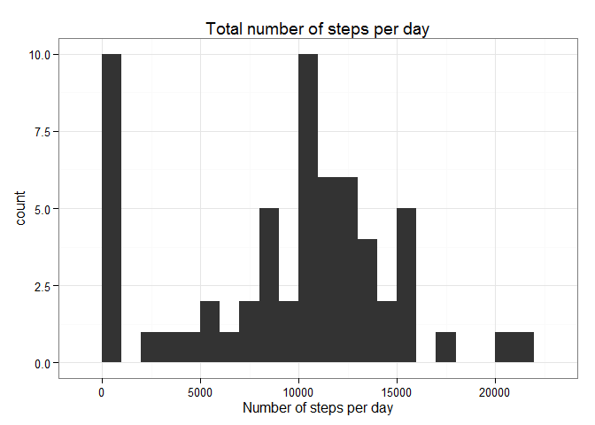
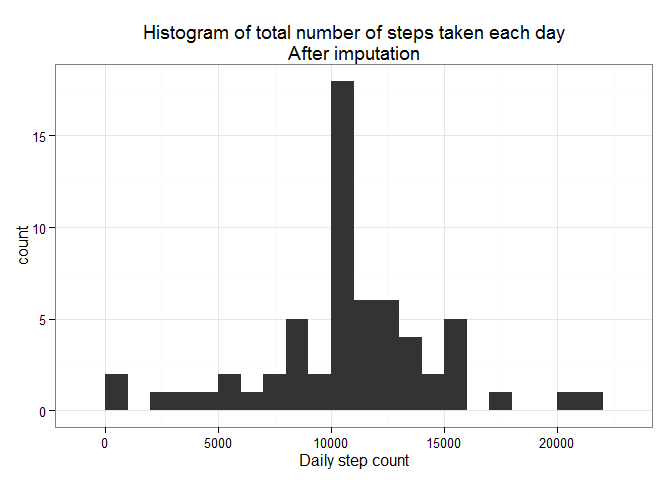

# Reproducible Research: Peer Assessment 1

# SECTION 1: Calculating and plotting the mean of the total number of steps per day

## Loading and preprocessing the data


```r
dataActivity <- read.csv(file="activity.csv")
dataActivity$date <- as.Date(dataActivity$date)
```

## What is mean total number of steps taken per day?

1.- Calculate the total number of steps taken by day


```r
library("dplyr")
```

```
## 
## Attaching package: 'dplyr'
## 
## The following object is masked from 'package:stats':
## 
##     filter
## 
## The following objects are masked from 'package:base':
## 
##     intersect, setdiff, setequal, union
```

```r
library("ggplot2")
```

```
## Warning: package 'ggplot2' was built under R version 3.1.3
```

```r
dayStepCount <- dataActivity %>% group_by(date) %>% summarise(day.count = sum(steps, na.rm=TRUE))
```

2.- Make a histogram of the total number of steps taken each day, then calculate and report the mean and median of the total number of steps taken per day.


```r
mean(dayStepCount$day.count, na.rm=T)
```

```
## [1] 9354.23
```

```r
median(dayStepCount$day.count, na.rm=T)
```

```
## [1] 10395
```

```r
ggplot(dayStepCount) + geom_histogram(aes(x = day.count), binwidth = 1000) + 
        theme_bw() + ggtitle('Total number of steps per day') + xlab('Number of steps per day')
```

 

## What is the average daily activity pattern?

1.- Make a time series plot (i.e. type = "l") of the 5-minute interval (x-axis) and the average number of steps taken, averaged across all days (y-axis)


```r
tidyData <- dataActivity[!is.na(dataActivity$date) & !is.na(dataActivity$steps),]
plotData <- tapply(tidyData$steps, tidyData$interval, mean, na.rm=T)
plot(names(plotData), plotData,type="l", xlab = "Interval", ylab = "Average Steps")
```

 

2.-Which 5-minute interval, on average across all the days in the dataset, contains the maximum number of steps?


```r
maxInterval<-which.max(plotData)
maxInterval
```

```
## 835 
## 104
```

## Imputing missing values

1.- Calculate and report the total number of missing values in the dataset (i.e. the total number of rows with NAs)


```r
summary(dataActivity)
```

```
##      steps             date               interval     
##  Min.   :  0.00   Min.   :2012-10-01   Min.   :   0.0  
##  1st Qu.:  0.00   1st Qu.:2012-10-16   1st Qu.: 588.8  
##  Median :  0.00   Median :2012-10-31   Median :1177.5  
##  Mean   : 37.38   Mean   :2012-10-31   Mean   :1177.5  
##  3rd Qu.: 12.00   3rd Qu.:2012-11-15   3rd Qu.:1766.2  
##  Max.   :806.00   Max.   :2012-11-30   Max.   :2355.0  
##  NA's   :2304
```

With this simple function we know that there are 2304 NA's only in the steps field, and now we can proceed to impute missing values, the strategy that I'm going to use is use the mean of steps taken at each interval.


```r
# Mean step count per inteval
MeanActivity <- dataActivity %>% group_by(interval) %>% 
    summarise(meanSteps = mean(steps, na.rm = T))
dataActivity.Imputed <- left_join(dataActivity, MeanActivity)
```

```
## Joining by: "interval"
```

```r
# If step is NA change to meansteps
dataActivity.Imputed <- dataActivity.Imputed %>% mutate(steps = ifelse(is.na(steps),round(meanSteps,0),steps))
```

The new DataSet with imputed data is dataActivity.Imputed.

Make a histogram of the total number of steps taken each day and Calculate and report the mean and median total number of steps taken per day. Do these values differ from the estimates from the first part of the assignment? What is the impact of imputing missing data on the estimates of the total daily number of steps?


```r
# Number of steps/day imputed
dayStepCount.imp <- dataActivity.Imputed %>% group_by(date) %>% 
        summarise(day.count = sum(steps))

# Mean and median number of steps/day imputed
meanStepCount.imp <- dayStepCount.imp %>% ungroup() %>% 
        summarise(mean = mean(day.count, na.rm = T), median = median(day.count, na.rm = T))

ggplot(dayStepCount.imp) + geom_histogram(aes(x = day.count), binwidth = 1000) + 
        ggtitle('Histogram of total number of steps taken each day\nAfter imputation') + theme_bw() +
        xlab('Daily step count')
```

 

The comparison between means and nedian of the imputed and original data sets are almost the same, the strategy is working.


```r
## Imputed DS
meanStepCount.imp %>% data.frame
```

```
##       mean median
## 1 10765.64  10762
```

```r
## Original DS
mean(dayStepCount$day.count, na.rm=T)
```

```
## [1] 9354.23
```

```r
median(dayStepCount$day.count, na.rm=T)
```

```
## [1] 10395
```


## Are there differences in activity patterns between weekdays and weekends?
